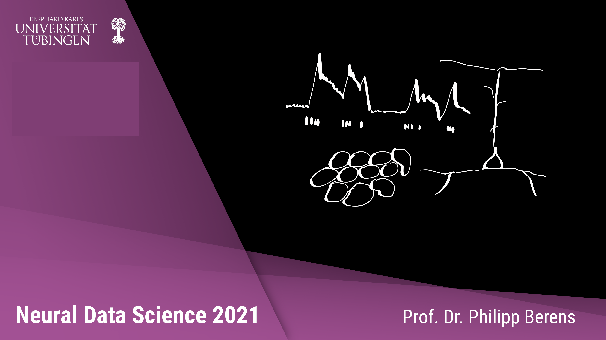

# Neural Data Science 

This repository contains the programming labs and lecture notes for the lecture "Neural Data Science" tought at [University of Tübingen](www.uni-tuebingen.de) in the summer term 2021.

## General Information
Lecturer: [Philipp Berens](mailto:philipp.berens@uni-tuebingen.de) [(twitter)](https://twitter.com/CellTypist)  
Lab: [homepage](www.berenslab.org) 
Lecture videos: [Youtube](https://www.youtube.com/playlist?list=PL05umP7R6ij3SxudmSWFL_zGh0BMrRdrx) 
Developed by: [Alexander Ecker](www.eckerlab.org), [Philipp Berens](mailto:philipp.berens@uni-tuebingen.de)

## Course Description

Machine learning techniques are frequently used in modern neuroscience to analyse data. In this course, you will learn about different applications scenarios for machine learning algorithms and other data analysis techniques in neuroscience. You will implement basic algorithms and apply them to real data, thus allow you to experience the challenges of working with real data in a learning setting. The course covers preprocessing raw electrophysiological and two-photon imaging data (spike detection, spike sorting, spike inference), spike train analysis and systems identification, neural population analysis as well as analyzing single cell transcriptomics and morphological reconstructions.

You need to download the data package: http://doi.org/10.5281/zenodo.4704658

## Content
1. Spike Detection and Feature Extraction: [lecture](https://youtu.be/8xeC5CV4UB8), [coding lab](notebook/CodingLab1.ipynb)
